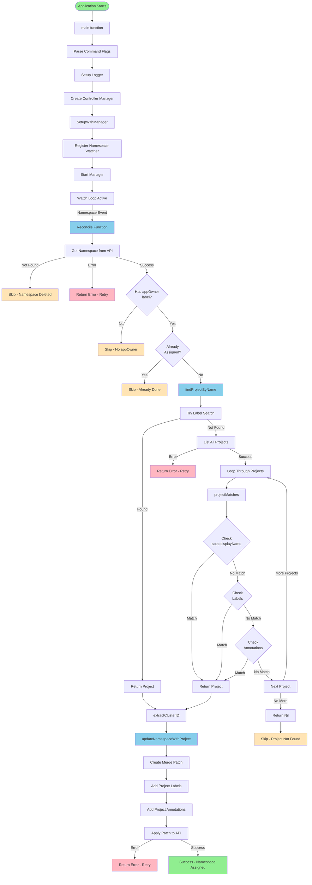
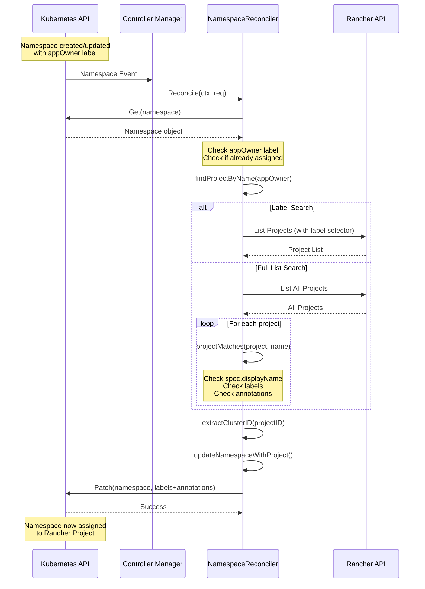

# Controller Architecture Diagram

This document explains the architecture and function call flow of the QN Rancher Operator controller.

## Mermaid Diagram



## Function Call Sequence Diagram



## High-Level Architecture

```
┌─────────────────────────────────────────────────────────────────┐
│                         Kubernetes Cluster                      │
│                                                                  │
│  ┌──────────────────┐         ┌──────────────────────────┐   │
│  │   Namespaces     │◄────────┤  Controller Manager       │   │
│  │  (with appOwner  │         │  (controller-runtime)     │   │
│  │     labels)      │         │                           │   │
│  └──────────────────┘         └──────────────────────────┘   │
│           ▲                              │                      │
│           │                              │                      │
│           │                              ▼                      │
│           │                    ┌──────────────────────────┐   │
│           │                    │  NamespaceReconciler     │   │
│           │                    │  (Our Controller)        │   │
│           │                    └──────────────────────────┘   │
│           │                              │                      │
│           │                              │                      │
│           └──────────────────────────────┘                      │
│                                                                  │
│  ┌──────────────────┐         ┌──────────────────────────┐   │
│  │ Rancher Projects │◄────────┤  Rancher Management API   │   │
│  │ (management.cattle│         │  (management.cattle.io)   │   │
│  │      .io/v3)      │         │                           │   │
│  └──────────────────┘         └──────────────────────────┘   │
└─────────────────────────────────────────────────────────────────┘
```

## Function Call Flow

### 1. Application Startup (main.go)

```
main()
  │
  ├─► Parse command-line flags (metrics, health probe, leader election)
  │
  ├─► ctrl.SetLogger() - Setup structured logging
  │
  ├─► ctrl.NewManager() - Create controller manager
  │   │
  │   ├─► Initialize Kubernetes client
  │   ├─► Setup informers/cache
  │   ├─► Setup metrics server
  │   └─► Setup health probes
  │
  ├─► NamespaceReconciler.SetupWithManager()
  │   │
  │   └─► ctrl.NewControllerManagedBy()
  │       │
  │       ├─► Register watch for core/v1 Namespace resources
  │       └─► Register Reconcile() as the handler
  │
  ├─► mgr.AddHealthzCheck() - Add health check endpoint
  ├─► mgr.AddReadyzCheck() - Add readiness check endpoint
  │
  └─► mgr.Start() - Start the controller manager
      │
      └─► Begin watching namespaces and triggering Reconcile()
```

### 2. Reconciliation Loop (controllers/namespace_controller.go)

```
Controller Manager detects Namespace event
  │
  ▼
Reconcile(ctx, req ctrl.Request)
  │
  ├─► r.Get(ctx, req.NamespacedName, namespace)
  │   └─► Fetch Namespace from Kubernetes API
  │       │
  │       ├─► If NotFound → return (namespace deleted)
  │       └─► If error → return error
  │
  ├─► Check namespace.Labels["appOwner"]
  │   │
  │   ├─► If missing/empty → return (skip)
  │   └─► If exists → continue
  │
  ├─► Check namespace.Labels["field.cattle.io/projectId"]
  │   │
  │   ├─► If already assigned → return (skip, already done)
  │   └─► If not assigned → continue
  │
  ├─► r.findProjectByName(ctx, appOwner)
  │   │
  │   ├─► Try label-based search (efficient)
  │   │   │
  │   │   ├─► Search with label "project.cattle.io/name"
  │   │   ├─► Search with label "cattle.io/projectName"
  │   │   └─► Search with label "field.cattle.io/projectName"
  │   │
  │   ├─► If label search fails → List all projects
  │   │   │
  │   │   └─► r.List(ctx, projectList)
  │   │       │
  │   │       └─► For each project:
  │   │           │
  │   │           └─► r.projectMatches(project, projectName)
  │   │               │
  │   │               ├─► Check spec.displayName
  │   │               ├─► Check labels (case-insensitive)
  │   │               └─► Check annotations (case-insensitive)
  │   │
  │   └─► Return matching project or nil
  │
  ├─► If project == nil → return (project not found)
  │
  ├─► project.GetName() - Get project ID (format: c-xxxxx:p-xxxxx)
  │
  ├─► r.extractClusterID(projectID)
  │   │
  │   └─► Split projectID by ":" and return first part (cluster ID)
  │
  └─► r.updateNamespaceWithProject(ctx, namespace, projectID, clusterID)
      │
      ├─► Create patch using client.MergeFrom()
      │
      ├─► Add labels:
      │   ├─► field.cattle.io/projectId = projectID
      │   └─► field.cattle.io/clusterId = clusterID (if available)
      │
      ├─► Add annotations:
      │   └─► field.cattle.io/projectId = projectID
      │
      └─► r.Patch(ctx, namespace, patch)
          │
          └─► Apply patch to Kubernetes API
              │
              └─► Namespace is now assigned to Rancher Project ✓
```

## Detailed Function Relationships

### Setup Phase

```
main()
  │
  ├─► init()
  │   └─► clientgoscheme.AddToScheme() - Register Kubernetes core types
  │
  ├─► ctrl.NewManager()
  │   └─► Creates Manager with:
  │       ├─► Client (for API calls)
  │       ├─► Cache (for watching resources)
  │       ├─► Scheme (type registry)
  │       └─► Event recorder
  │
  └─► NamespaceReconciler.SetupWithManager()
      │
      └─► ctrl.NewControllerManagedBy(mgr)
          │
          ├─► For(&corev1.Namespace{}) - Watch Namespace resources
          │
          └─► Complete(r) - Register Reconcile() as handler
```

### Runtime Phase (Event-Driven)

```
Kubernetes Event (Namespace created/updated)
  │
  ▼
Controller Manager
  │
  ├─► Detects event via informer
  │
  ├─► Creates ctrl.Request{Name: namespace.Name}
  │
  └─► Calls Reconcile(ctx, req)
      │
      └─► [See Reconciliation Loop above]
```

## Data Flow

```
┌──────────────┐
│  Namespace   │
│              │
│ Labels:      │
│  appOwner:   │──┐
│   "DevOps"   │  │
└──────────────┘  │
                  │
                  ▼
         ┌──────────────────────┐
         │    Reconcile()       │
         └──────────────────────┘
                  │
                  ▼
         ┌──────────────────────┐
         │  findProjectByName   │
         │    (appOwner)        │
         └──────────────────────┘
                  │
        ┌─────────┴─────────┐
        │                   │
        ▼                   ▼
┌──────────────┐   ┌─────────────────┐
│ Label Search │   │ List All + Match│
│ (efficient)  │   │ (fallback)      │
└──────────────┘   └─────────────────┘
        │                   │
        └─────────┬─────────┘
                  │
                  ▼
         ┌──────────────────────┐
         │  projectMatches()    │
         │  - spec.displayName   │
         │  - labels             │
         │  - annotations        │
         └──────────────────────┘
                  │
                  ▼
         ┌──────────────────────┐
         │   Project Found      │
         │   ID: c-xxx:p-xxx    │
         └──────────────────────┘
                  │
                  ▼
         ┌──────────────────────┐
         │  extractClusterID    │
         │  (from projectID)    │
         └──────────────────────┘
                  │
                  ▼
         ┌──────────────────────┐
         │updateNamespaceWith   │
         │      Project()        │
         │                       │
         │ Adds:                 │
         │  - projectId label    │
         │  - clusterId label    │
         │  - projectId annot    │
         └──────────────────────┘
                  │
                  ▼
         ┌──────────────────────┐
         │   Namespace           │
         │   Updated ✓          │
         └──────────────────────┘
```

## Key Components

### NamespaceReconciler Struct

```go
type NamespaceReconciler struct {
    client.Client  // Kubernetes client for API calls
    Scheme *runtime.Scheme  // Type registry
}
```

### Main Functions

1. **Reconcile()** - Main reconciliation logic
   - Entry point for each namespace event
   - Orchestrates the assignment process

2. **findProjectByName()** - Project discovery
   - Searches for Rancher Projects by name
   - Uses multiple strategies (labels, then full list)

3. **projectMatches()** - Project matching logic
   - Checks spec.displayName
   - Checks labels and annotations
   - Case-insensitive matching

4. **extractClusterID()** - ID parsing
   - Extracts cluster ID from project ID format

5. **updateNamespaceWithProject()** - Namespace update
   - Adds required labels and annotations
   - Uses strategic merge patch

6. **SetupWithManager()** - Controller registration
   - Registers the controller with the manager
   - Sets up namespace watching

## Event Flow Example

```
1. User creates namespace:
   kubectl create namespace my-app
   kubectl label namespace my-app appOwner=DevOps

2. Kubernetes API Server emits event

3. Controller Manager's informer detects event

4. Manager queues Reconcile request:
   Reconcile(ctx, {Name: "my-app"})

5. Reconcile() executes:
   - Fetches namespace "my-app"
   - Finds appOwner="DevOps"
   - Searches for "DevOps" project
   - Finds project "c-abc123:p-xyz789"
   - Updates namespace with project labels

6. Namespace now has:
   labels:
     appOwner: DevOps
     field.cattle.io/projectId: c-abc123:p-xyz789
     field.cattle.io/clusterId: c-abc123
   annotations:
     field.cattle.io/projectId: c-abc123:p-xyz789

7. Rancher recognizes namespace as part of "DevOps" project ✓
```

## Error Handling

```
Reconcile()
  │
  ├─► Namespace not found → return (no error, just skip)
  │
  ├─► No appOwner label → return (no error, skip)
  │
  ├─► Already assigned → return (no error, skip)
  │
  ├─► Project not found → return (no error, log and skip)
  │
  ├─► Error fetching namespace → return error (retry)
  │
  ├─► Error listing projects → return error (retry)
  │
  └─► Error patching namespace → return error (retry)
```

Controller-runtime automatically retries on errors with exponential backoff.
